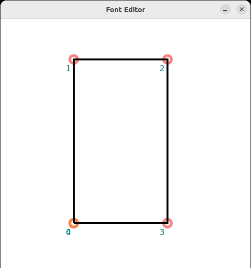

# twin-fedit
`twin-fedit` is a tool allowing users to edit specific scalable fonts
which are expected to fit the requirements of embedded systems with larger screens.

<p align="center">
  
</p>

## Build Dependency
```shell
sudo apt-get install libsdl2-dev libcairo2-dev
```

## Usage
```shell
make
./twin-fedit nchars
```

## Background
The glyphs in `twin-fedit` is originated from [Hershey vector fonts](https://en.wikipedia.org/wiki/Hershey_fonts), which were created by Dr. A. V. Hershey while working at the U. S. National Bureau of Standards.

The Hershey vector fonts set of `twin-fedit` is [`nchars`](nchars), for example, the interpolation points and operations used to draw the glyph `1` are as follows
```
/* 0x31 '1'  offset 666 */
    0, 10, 42, 0, 2, 3,
    0, 10, /* snap_x */
    -21, -15, 0, /* snap_y */
    'm', 0, -34,
    'c', 4, -35, 8, -38, 10, -42,
    'l', 10, 0,
    'e',
```

The first line to 4-th line are used to draw the glyph.

The first line of is the header that contains the information of the character `1`, `0x31` is the ASCII code of `1` and offset `666` is the 

The character `m` is an abbreviation for `move to`, and the values following `m` represent the x and y positions to move to in the drawing window's coordinate system, respectively.

The character `c` is an abbreviation for `curve to`, and the values following `c` represent three x-y coordinate points used to draw a cubic Bézier curve, in the order of the first control point, the second control point, and the endpoint.

The character `l` is an abbreviation for `line to`, and the values following `l` represent the x and y positions to move to, relative to the position from the previous operation, in the drawing window's coordinate system, respectively.

The character `e` is an abbreviation for `end`.

According to the steps outlined above for drawing glyph `1`, it can be split into the following steps:

1. `'m' 0,-34`: Move to `0,-34` and plot a point at `0,-34`.  
2. `'c' 4, -35, 8, -38, 10, -42`: Starting from `0,-34` and ending at `10,-42`, draw a curve using Bézier curve with the first control point at `4,-35` and the second control point at `8,-38`.  
3. `'l' 10,0`: Starting from `10,-42` and ending at `10,0`, draw a straight line.  
4. `'e'`: End the drawing of glyph `1`.

Each point seen in `twin-fedit` corresponds to an operation. By selecting a point in `twin-fedit`, you can modify the coordinates to edit any glyph.

## Quick Guide
For each glyph, there are the following shortcut keys used for editing the glyph.

| Key  | Functionality |
|   ---       |   ---    |
|  ESC  | Exit program |
| left mouse button | Select a point as the first operation for that glyph |
| right mouse button | Select a point as the last operation for that glyph |
| d | Delete selected point|
| f | Replace a line with a spline |
| q | Switch to next character |
| s | Split a spline into two splines by start point and end point |
| u | Undo the last operation |


To move a point
1. Select a point by left mouse button,
2. Use arrow keys to move the selected point.

To move a control point
1. Select a point with two control points by left mouse button,
2. Use arrow keys to move the first control point,
3. Keep pressing shift key and use arrow keys to move the second control point.

To split a spline or line
1. Select two point by left and right mouse button,
2. Use s key to split the line or spline into two segments.

To replace the line or spline by another spline
1. Select two point by left and right mouse button as start and end of the another spline,
2. Use f key to replace the line or spline with another spline.

To delete a point
1. Select a point by left mouse button,
2. Use d key to delete the selected point.

To undo any operations above
1. Use u key.